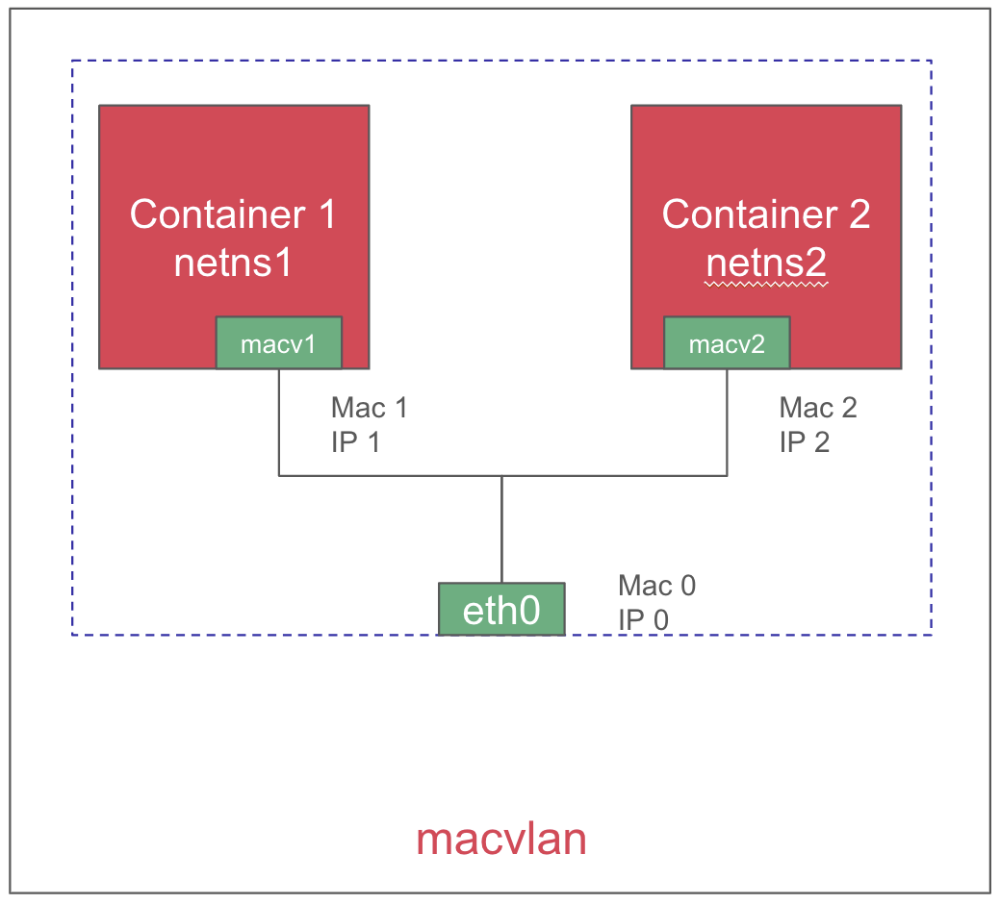

# Utiliser les capacités temps réel d'OpenShift

Face à l'essor des applications à contraintes temps réel dans les environnements industriels et financiers, les entreprises doivent repenser leurs infrastructures pour offrir à la fois flexibilité, faible latence et robustesse. OpenShift, la plateforme de Red Hat basée sur Kubernetes, propose des capacités temps réel pour des workloads containers et machines virtuelles, tout en garantissant la sécurité de ceux-ci.   
Cet article explore comment configurer une infrastructure mixte *- containers et VMs -* optimisée pour les contraintes temps réel.

## Contexte et enjeux des contraintes temps réel sur OpenShift

### Les défis des workloads temps réel

Les applications temps réel exigent un traitement des données et une réponse aux événements dans des délais extrêmement courts et stables. Parmi les enjeux principaux, on retrouve :  
- **La prévisibilité du temps de réponse** : L'isolation des ressources (CPU, mémoire et E/S) est indispensable pour éviter les interférences.  
- **La latence réseau minimale** : Pour les communications critiques, il est souvent nécessaire d'utiliser des interfaces réseau qui contournent les couches de virtualisation classiques.  
- **La gestion simultanée de containers et de VMs** : Certains workloads hérités fonctionnant en VM doivent cohabiter avec des applications nativement containerisées, sans compromettre la performance globale.  

### OpenShift comme plateforme unifiée

OpenShift permet de réunir ces deux types de workloads à l'aide de son opérateur OpenShift Virtualization. Ainsi, il devient possible de gérer dans une même plateforme des applications containerisées ultra réactives et des VMs pour des charges traditionnelles. Cette approche facilite notamment la migration progressive des applications vers des architectures modernes tout en garantissant un temps de réponse optimal.

## Intégration de containers et VMs pour des workloads temps réel

### Configuration d'OpenShift

Pour exécuter des workloads temps réel, OpenShift doit être configuré avec :  
- **Un noyau temps réel** : Disponible via l'opérateur OpenShift RT, ce noyau permet d'améliorer la stabilité des temps de réponse.  
- **L'isolation des CPUs** : En dédiant des cœurs spécifiques aux tâches critiques, on réduit la variabilité des performances.  
- **L'optimisation des interruptions** : Ajuster les IRQs et configurer l'affinité CPU permet d'éviter les interruptions non désirées.  
- **L'utilisation de HugePages** : Cela optimise l'utilisation mémoire et améliore la gestion des latences.   
Tout ceci peut être configuré à l'aide d'un `PerformanceProfile`.


### Configuration d'un PerformanceProfile

L'activation des performances temps réel passe par la création d'un `PerformanceProfile` dédié :
```yaml
---
apiVersion: performance.openshift.io/v2
kind: PerformanceProfile
metadata:
  name: rt-profile
spec:
  cpu:
    isolated: 2-7
    reserved: 0-1
  hugepages:
    defaultHugepagesSize: 1G
    pages:
      - count: 4
        size: 1G
  realTimeKernel:
    enabled: true
  workloadHints:
    realTime: true
  nodeSelector:
    node-role.kubernetes.io/worker-rt: ""
```

### Déploiement d'un container temps réel

Pour déployer un container temps réel sur OpenShift en QoS guaranteed :
```yaml
apiVersion: v1
kind: Pod
metadata:
  name: rt-container
spec:
  containers:
  - name: app-rt
    image: registry.example.com/rt-app:latest
    resources:
      requests:
        cpu: "2"
        memory: "2Gi"
        hugepages-1Gi: "2Gi"
      limits:
        cpu: "2"
        memory: "2Gi"
        hugepages-1Gi: "2Gi"
    securityContext:
      capabilities:
        add:
        - SYS_NICE # Allows the container to adjust scheduling priorities.
        - IPC_LOCK # Enables locking memory to prevent swapping (used in real-time applications).
```

### Explication des QoS dans OpenShift

`guaranteed`: Cette classe garantit l'allocation des ressources, elle est définie lorsqu'on spécifie `requests`égal à `limits`.

`burstable` : Cette classe permet d'allouer plus de ressources si celles-ci sont disponibles, elle est définie lorsqu'on spécifie `limits` supérieur à `requests`.

`bestEffort` : Cette classe utilise les ressources disponibles dynamiquement et peut être expulsé si le nœud manque de ressources, elle est définie lorsqu'on ne spécifie aucune `requests` et aucune `limits`.

### Déploiement d'une VM temps réel

Pour créer une VM temps réel avec OpenShift Virtualization :
```yaml
apiVersion: kubevirt.io/v1
kind: VirtualMachine
metadata:
  name: rt-vm
spec:
  running: true
  template:
    spec:
      domain:
        cpu:
          model: "host-passthrough" # Uses the host CPU model for optimal performance.
          cores: 2 # Number of virtual CPU cores allocated to the VM.
          dedicatedCpuPlacement: true # Ensures CPU cores are dedicated for the VM.
          isolateEmulatorThread: true # Isolates the emulator thread for better latency.
        memory:
          hugepages:
            pageSize: "1Gi"
        resources:
          requests:
            memory: "4Gi"
          limits:
            memory: "4Gi"
        devices:
          disks:
            - name: rootdisk
              disk:
                bus: virtio
          interfaces:
            - name: default
              bridge: {}
      networks:
        - name: default
          pod: {}
  dataVolumeTemplates:
    - metadata:
        name: rt-vm-disk
      spec:
        source:
          http:
            url: "http://example.com/rt-vm.qcow2"
        pvc:
          accessModes:
            - ReadWriteOnce
          resources:
            requests:
              storage: 10Gi
```

### Explication des paramètres clés des VMs temps réel

`host-passthrough` : Ce paramètre permet de passer directement le modèle de CPU de l'hôte à la VM, garantissant ainsi une compatibilité et une performance maximales. Il évite l'émulation de certaines instructions CPU, réduisant ainsi la latence et augmentant la stabilité du temps de réponse.

`dedicatedCpuPlacement` : L'activation de cette option garantit que les cœurs CPU alloués à la VM ne seront pas partagés avec d'autres workloads, améliorant ainsi la prévisibilité des performances et minimisant l'interférence avec d'autres processus exécutés sur le nœud.

`isolateEmulatorThread` : L'activation de ce paramètre permet d'isoler le thread de l'émulateur, ce qui réduit la latence de l'émulation et améliore les performances en cas de workloads nécessitant un traitement rapide et déterministe.

## Utilisation d'une interface réseau L2

Les applications temps réel requièrent souvent une communication réseau à faible latence et haut débit. L'utilisation d'une interface réseau L2 permet de réduire la surcharge introduite par les couches de virtualisation réseau classiques et d'offrir une connectivité directe entre les workloads. 
{: .scaled-image }  

OpenShift permet d'exploiter Multus pour créer des interfaces L2 en utilisant macvlan.
{: .scaled-image }

### Création d'un NAD Multus en macvlan

```yaml
apiVersion: k8s.cni.cncf.io/v1
kind: NetworkAttachmentDefinition
metadata:
  name: l2-interface
  namespace: example-namespace
spec:
  config: '{
    "cniVersion": "0.3.1",
    "type": "macvlan",
    "master": "enp3s0",
    "mode": "bridge",
    "ipam": { "type": "dhcp" }
  }'
```

### Association d'une interface L2 à un container

```yaml
apiVersion: v1
kind: Pod
metadata:
  name: rt-container-l2
  annotations:
    k8s.v1.cni.cncf.io/networks: example-namespace/l2-interface
spec:
  containers:
  - name: rt-app
    image: registry.example.com/rt-app:latest
```

### Association d'une interface L2 à une VM

```yaml
spec:
  template:
    spec:
      networks:
        - name: l2-net
          multus:
            networkName: example-namespace/l2-interface
      domain:
        devices:
          interfaces:
            - name: l2-net
              bridge: {}
```

## Conclusion

OpenShift offre une plateforme unifiée pour exécuter des workloads temps réel en combinant containers et machines virtuelles. Grâce à ses capacités d'optimisation des performances, de gestion fine des ressources et de mise en réseau avancée, il répond aux exigences des environnements industriels et financiers critiques. En configurant correctement les ressources CPU, mémoire et réseau, il est possible d'atteindre une faible latence et une grande prévisibilité, garantissant ainsi la stabilité et la performance des applications temps réel.

